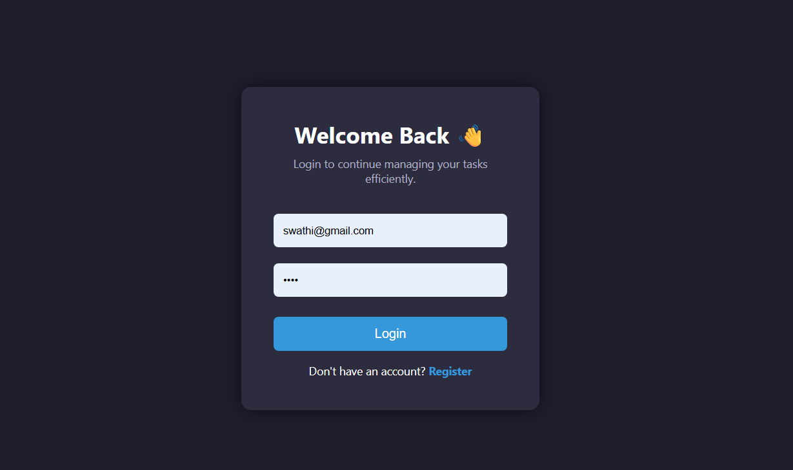
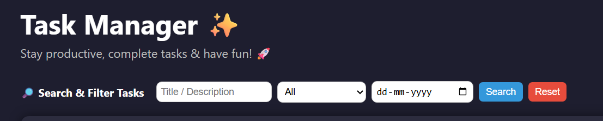

# 🚀 Task Manager – Full Stack Web Application

<p align="center">
  <b>A modern full-stack task management application built with React.js & FastAPI</b><br/>
  Secure • Responsive • JWT Auth • Production Ready
</p>

---

[🌐 **Open Live Web App Here!**](https://task-manager-web-app-jade.vercel.app)  

> Manage your tasks efficiently, stay organized, and boost productivity—all in one place! 📝✨


## 📌 Overview

> **Task Manager is a full-stack web application that allows users to securely manage their daily tasks with authentication, filtering, and responsive UI design.**

This project demonstrates:

- Frontend architecture using **React.js**
- Backend API development using **FastAPI**
- JWT-based authentication
- Full CRUD operations
- Production-ready project structure

---

## ✨ Features

### 🔐 Authentication
- User Registration
- User Login
- Secure Password Hashing
- JWT-based Authentication
- Protected Routes
- Token Validation Middleware

---

### 📋 Task Management
- ✅ Create Tasks  
- ✏️ Edit Tasks  
- 🗑 Delete Tasks  
- 🔄 Toggle Pending / Completed  
- 🔍 Search by Title & Description  
- 📅 Filter by Start Date  
- 📊 Filter by Status (Pending / Completed)  
- ♻ Reset Filters  
- 🌙 Dark / Light Mode  
- 📱 Fully Responsive Design  

---

## 📂 Project Structure

```
task-manager/
│
├── backend/
│   ├── main.py
│   ├── auth.py
│   ├── database.py
│   ├── schemas.py
│   └── requirements.txt
│
├── frontend/
│   ├── src/
│   │   ├── components/
│   │   │   └── ProtectedRoute.js
│   │   ├── pages/
│   │   │   ├── Dashboard.jsx
│   │   │   ├── Login.jsx
│   │   │   └── Register.jsx
│   │   ├── api.js
│   │   └── App.jsx
│
└── README.md
```

This layered architecture ensures:

- Separation of concerns
- Maintainability
- Scalability
- Clean code structure


> **A full-stack web application to manage your tasks efficiently, stay organized, and boost productivity.** 🚀  

---

## Table of Contents
1. [Demo](#demo)
2. [Project Overview](#project-overview)
3. [Features & Screenshots](#features--screenshots)
   - [Login Page](#login-page)
   - [Register Page](#register-page)
   - [Dashboard](#dashboard)
   - [Task Card](#task-card)
   - [Search & Filter](#search--filter)
   - [Profile & Logout](#profile--logout)
4. [Tech Stack](#tech-stack)
5. [Installation & Running Locally](#installation--running-locally)
6. [Challenges & Solutions](#challenges--solutions)
7. [Future Improvements & Plans](#future-improvements--plans)
8. [About the Developer](#about-the-developer)
9. [Contributing](#contributing)
10. [License](#license)

---

## Demo 🎬

🔗 **Frontend:** [Live App on Vercel](https://task-manager-web-app-jade.vercel.app)  
🔗 **Backend:** [API on Render](https://task-manager-backend-tqpj.onrender.com)


---

## Project Overview 🏗️

The **Task Manager Web App** is a full-stack application built with **React.js** (frontend) and **FastAPI** (backend).  

It allows users to:  
- Register and securely login ✅  
- Add, edit, delete, and manage tasks efficiently  
- Filter and search tasks  
- View a responsive dashboard  
- Experience **real-time feedback** with loading spinners and alerts  

This project demonstrates **authentication, CRUD operations, API integration, state management, and deployment-ready features**.

---

## Features & Screenshots 🌟

### 1️⃣ Login Page


**Features:**
- Email & password input fields  
- Spinner & message: “Login in progress… checking credentials” when user clicks login  
- Successful login redirects to **Dashboard**  
- Navigation to **Register page** if user is new  

> 💡 The spinner ensures the user knows login is in progress, improving UX and reducing confusion during API response delay.

---

### 2️⃣ Register Page


**Features:**
- New users can register with email & password  
- Form validations prevent empty fields  
- After registration, users are redirected to login automatically  

> 🌟 Navigation is simple: Register → Login → Dashboard.

---

### 3️⃣ Dashboard


**Features:**
- Lists all tasks in card layout  
- Users can **add**, **edit**, and **delete** tasks  
- Real-time task updates after every action  
- Responsive design for mobile & desktop  

---

### 4️⃣ Task Card


**Features:**
- Displays **Title, Description, Status**  
- Shows **Created & Updated timestamps**  
- Action buttons: **Edit** / **Delete**  
- Click **Edit** → Task form appears  
- Click **Delete** → Task is removed  

> 📝 Task cards provide a clear view of each task’s status and details.

---

### 5️⃣ Search & Filter


**Features:**
- Search tasks by **title** or **description**  
- Filter tasks by **status** or **date**  
- Immediate results for efficient task management  

> 🔍 Helps users quickly find relevant tasks without scrolling.

---

### 6️⃣ Profile & Logout


**Features:**
- Displays user **email and profile info**  
- **Logout button** clears token and redirects to login  
- Session token is stored in `localStorage` for persistent login  

> 🛡️ Ensures secure session management and smooth navigation.

---

## Tech Stack 🛠️

**Frontend:**  
- React.js (Functional Components + Hooks)  
- Vite  
- CSS Flexbox & Grid  
- React Toastify for alerts & notifications  

**Backend:**  
- Python 3.12 + FastAPI  
- PostgreSQL + SQLAlchemy ORM  
- JWT Authentication  
- Bcrypt for password hashing  
- CORS middleware for API access  

**Deployment:**  
- Frontend: Vercel  
- Backend: Render  

---

## Installation & Running Locally 🖥️

### Clone the repository
```bash
-open command prompt & paste this below command:

git clone https://github.com/swathi-gurijala/Task_Manager_Web_App.git

- Then paste this below one , to go into the project folder:

cd Task_Manager_Web_App

## Backend Setup

- Go into the backend folder: 
cd backend
python -m venv .venv

# Activate environment

# Windows
.venv\Scripts\activate

# Linux / Mac
source .venv/bin/activate

- To install the project requirements into the local environment:

pip install -r requirements.txt

-  To run the backend code:

uvicorn main:app --reload

## Frontend Setup

- Go into the frontend folder:

cd frontend

- Install node modules and other requirments for react frontend:

npm install

- Run the frontend in localhost using this command:

npm run dev

✅ Open your browser at http://localhost:5173 (or port shown in terminal) to test the app locally.

```

## Challenges & Solutions 💡

*CORS Policy Errors: Added CORSMiddleware to backend**

*Login delay confusion: Added spinner & “Login in progress” message*

*404 on page refresh: Added _redirects and vercel.json for proper routing*

*Bcrypt 72-byte issue: Pinned to bcrypt 4.0.1 for Python 3.12*

**💪 Multiple days of debugging, testing, and deployment improvements went into making this smooth and production-ready.**

### Future Improvements & Plans 🚀

+ Task priority & deadlines

+ Real-time collaboration & shared tasks

+ Push notifications for pending tasks

+ Export tasks to PDF / Excel

+ AI-powered task prioritization suggestions

+ Additional analytics & stats for user productivity

**🌟 Open to feature suggestions and contributions from the community.**

## About the Developer 👩‍💻

| Name | Swathi Gurijala |
|------|----------------|
| Role | B.Tech (3rd Year) AIML Student & Full-Stack Developer Intern |
| Email | swathigurijala131@gmail.com |
| GitHub | [swathi-gurijala](https://github.com/swathi-gurijala) |
| LinkedIn | [Swathi Gurijala](https://www.linkedin.com/in/swathi-gurijala/) |
| Skills | Java, Python, React.js, FastAPI, MySQL, MongoDB, AI/ML, Frontend & Backend Development |
| Hobbies | Singing 🎤, Dancing 💃, Exploring Tech Projects 🚀 |

+ Passionate about building real-world applications and constantly improving coding skills. Open to collaboration, mentorship, and new challenges!

+ Passionate about Full-Stack Web Development, AI/ML, and building real-world applications❤️

+ Enjoys creating intuitive UI/UX and problem-solving with code


**Turning ideas into functional, polished applications with love ❤️ and hard work ☕.**

### Contributing 🤝
We welcome contributions!

- Fork the repo

- Create a feature branch: git checkout -b feature-name

- Commit your changes: git commit -m "Add new feature"

- Push to branch: git push origin feature-name

- Open a Pull Request

#### License 📄
MIT License - see LICENSE for details


